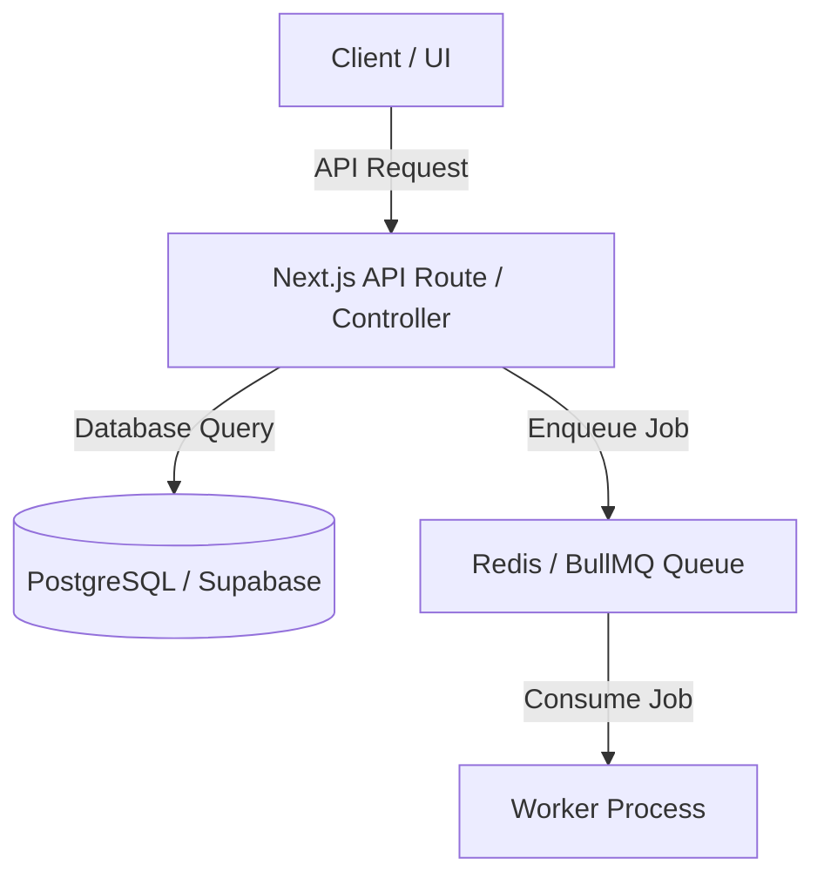

# Technical Design Specification: `<feature-slug>`

## 1. Architecture & System Context
- **Affected Components**:
- **Design Overview**:
- **Backward Compatibility Strategy**:



---

## 2. Data Model & Database Schema Changes
- **Target Table(s)**:
- **DDL / Migration Plan**:
```sql
-- Migration snippet
ALTER TABLE target_table ADD COLUMN IF NOT EXISTS new_column VARCHAR(255);
```
- **Indexes & Constraints**:

---

## 3. API Contracts & Endpoint Design
- **Endpoint**: `POST /api/v1/...`
- **Headers**: `Authorization: Bearer <token>`
- **Request Payload**:
```json
{
  "field_name": "string"
}
```
- **Response Payload (200 OK)**:
```json
{
  "success": true,
  "data": {}
}
```
- **Error Codes**: `400 Bad Request`, `401 Unauthorized`, `403 Forbidden`, `409 Conflict`.

---

## 4. Security, Auth & Tenant Isolation
- **Authentication**: JWT / Session validation.
- **Authorization**: Role check (`admin`, `agent`, etc.).
- **Tenant Scope**: `WHERE tenant_id = current_tenant_id` on all queries.

---

## 5. Rollback & Disaster Recovery
- **Database Rollback SQL**:
- **Service Rollback Procedure**:
