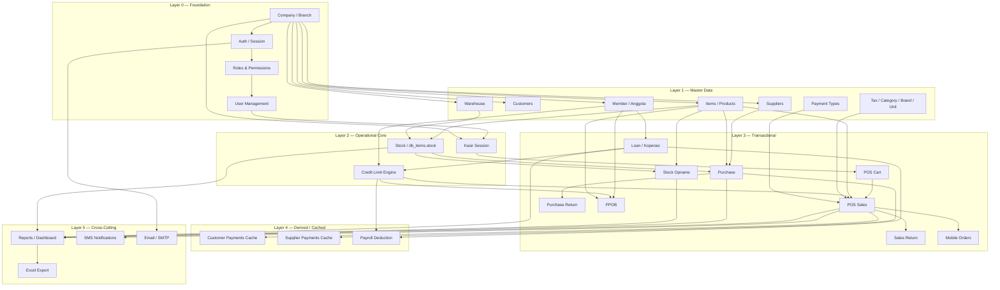

# Migration Dependency Graph — KKISI → Next.js

> Determines which modules must exist before others can be safely migrated or built.
> An arrow `A → B` means **B depends on A** (A must be migrated/stable first).

---

## Dependency Rationale

Dependencies are derived from actual FK relationships and runtime call chains documented in `kkisi.web/04-database.md`, `05-data-flow.md`, and `06-business-rules.md`:

| Dependency | Why |
|---|---|
| Company → everything | `company_id` scopes almost every table and query |
| Auth/RBAC → everything | All protected routes require session + permission check |
| Users/Roles → Auth | Login validates against `db_users`/`db_roles`/`db_permissions` |
| Items → Stock, POS, Purchase, PPOB | `db_items.stock` is mutated by all of these |
| Member (Anggota) → Credit Limit, POS Kredit, PPOB, Loan | `m_anggota.nik_kar` is the join key for all credit logic |
| Kasir Session → POS | POS is gated by `cek_buka_kasir()` |
| POS Cart → POS Sale | Sale is built from cart rows |
| Stock/Inventory → Purchase, POS, Sales Return, Stock Opname | All these mutate `db_items.stock` + write `db_stockentry` |
| Purchase → Supplier Payments | `record_supplier_payment()` runs after purchase payment |
| Sales → Customer Payments | `record_customer_payment()` runs after sales payment |
| Loan (trans_pinjaman) → Member Credit (gaji_minus) | `cek_gaji_minus()` reads active loans to override `limit_toko` |
| POS + Purchase + Expense → Reports/Dashboard | Reports aggregate from all transactional tables |
| IAK API config → PPOB | PPOB cannot function without IAK credentials |

---

## Mermaid Dependency Graph



---

## Layered Migration Order

### Layer 0 — Foundation (migrate first, no dependencies)
1. **Company / Branch** — `db_company`
2. **Auth / Session**
3. **Roles & Permissions (RBAC)**
4. **User Management**

> Nothing else can be built without these. All subsequent modules assume authenticated, company-scoped context.

---

### Layer 1 — Master Data (depends only on Layer 0)
5. **Items / Products** — `db_items`, `db_category`, `db_brands`, `db_units`
6. **Customers**
7. **Suppliers**
8. **Member / Anggota** — `m_anggota`
9. **Warehouse**
10. **Tax / Payment Types / Currency**

> These are pure CRUD with no complex business logic — safe to migrate early and in parallel.

---

### Layer 2 — Operational Core (depends on Layer 0 + 1)
11. **Kasir Session** — depends on Users, Company
12. **Stock Engine** (`db_items.stock`, `db_stockentry`) — depends on Items, Warehouse
13. **Credit Limit Engine** (`tagihan_anggota`) — depends on Member

> These are the shared "kernels" reused by every transactional module. Must be rock-solid and fully parity-tested before Layer 3 begins.

---

### Layer 3 — Transactional Modules (depends on Layer 0–2)
14. **Purchase** — depends on Suppliers, Items, Stock Engine
15. **POS Cart → POS Sales** — depends on Kasir Session, Items, Credit Limit, Stock Engine
16. **Sales Return** — depends on POS Sales
17. **Purchase Return** — depends on Purchase
18. **Stock Opname** — depends on Stock Engine
19. **PPOB** — depends on Member, Credit Limit, Items, **external IAK API**
20. **Loan / Koperasi** — depends on Member
21. **Mobile Orders** — depends on POS Sales (shares `db_sales`)

> These are the highest business risk — financial correctness is critical. Each requires full characterization test parity before go-live.

---

### Layer 4 — Derived / Cached Data (depends on Layer 3)
22. **Customer Payments Cache** — depends on POS Sales
23. **Supplier Payments Cache** — depends on Purchase
24. **Payroll Deduction** — depends on Loan, Credit Limit

> Consider eliminating the cache-rebuild pattern in the new architecture — replace with a real-time computed view or materialized view instead of `DELETE + re-INSERT`.

---

### Layer 5 — Cross-Cutting Concerns (depends on Layer 3–4 data existing)
25. **Reports / Dashboard** — reads from all transactional tables
26. **SMS Notifications** — triggered by POS
27. **Email / SMTP** — triggered by Auth (OTP)
28. **Excel Export** — depends on Reports

> Can be migrated last since they are read-only aggregations or side-channel notifications — lowest risk of breaking core operations if delayed.

---

## What Can Migrate First (Recommended Order)

Modules that are **safe to build first** because they have minimal dependencies, low financial risk, and no external API coupling:

| Priority | Module | Reason |
|----------|--------|--------|
| 1 | **Company / Auth / RBAC** | Everything depends on this; no business logic risk |
| 2 | **Items / Products (CRUD only, no stock math yet)** | Pure master data |
| 3 | **Customers / Suppliers (CRUD only)** | Pure master data |
| 4 | **Member (Anggota) CRUD** | Pure master data (credit logic comes later) |
| 5 | **Stock Engine (read-only + adjustment)** | Foundational kernel other modules will call |
| 6 | **Kasir Session** | Small, well-bounded, no financial calculation |

**Do NOT migrate first** (high risk, defer until foundation is proven):
- POS Sales (financial correctness critical, many dependents)
- PPOB (external API + money movement)
- Loan/Payroll (complex date math, financial critical)
- Reports (depends on everything else being correct first — building reports against incomplete data guarantees rework)

---

## Circular Dependency Check

No circular dependencies were found. The one soft cycle to watch:

```
Loan → Credit Limit → POS
  ↑                     │
  └── (member's gaji_minus status can change based on
       whether their loan is active — but this is a
       READ dependency, not a write cycle)
```

This is safe because `Loan` only **informs** `Credit Limit` (read `trans_pinjaman` for `gaji_minus` check) — it does not require POS to exist first.

---

## Module Readiness Gate

A module is **not allowed to start implementation** until:
1. ✅ All its upstream dependencies (per this graph) are at least "Target Architecture" complete in `MIGRATION_MATRIX.md`
2. ✅ Its own characterization tests are written
3. ✅ Its own validation checklist items are verified against legacy

This prevents building POS on top of an unverified Stock Engine, for example.
