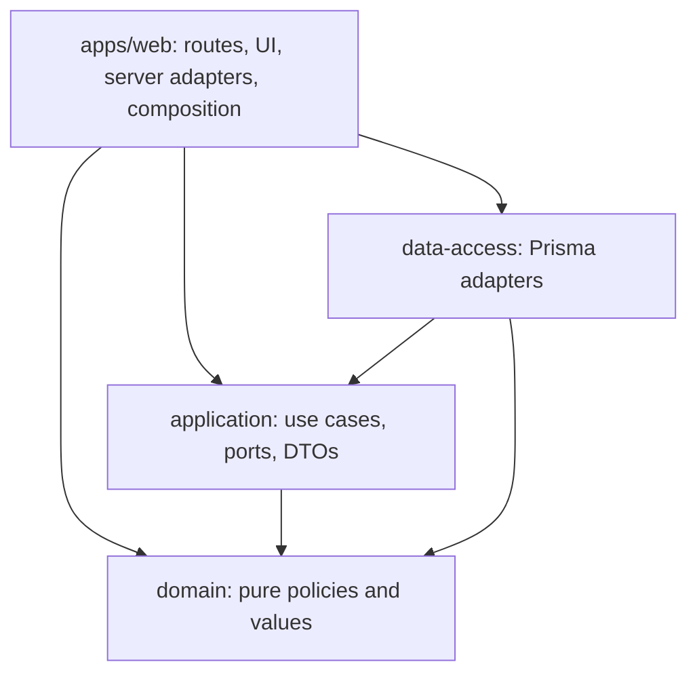

# Checkpoint 1 — Baseline & Monorepo Refactor Plan

Date: 2026-10-02 (Asia/Jakarta). Baseline: clean `master`, HEAD `3308355` (`style: Update css styling login & POS screen`). The baseline inventory below records CP1 before the move. Status: plan approved; CP2–4 implemented and verified on `refactor/monorepo-foundation`. The foundation is committed as `f203382`; the user authorized a separate CP4 commit and a clean working tree. See [Checkpoint 2](CHECKPOINT_2_WORKSPACE_FOUNDATION.md), [Checkpoint 3](CHECKPOINT_3_SHARED_INFRASTRUCTURE.md) and [Checkpoint 4](CHECKPOINT_4_DOMAIN_APPLICATION.md) reports. CP5–8 remain pending.

## 1. Scope and source of truth

Refactor the existing Next.js application, preserving its routes, UI, authentication, authorization, queries, calculations, and database ownership. Do not implement the unbuilt migration backlog, re-audit PHP, change database schemas/data/grants, deploy, or change the public-access policy. No commit or push is included in this checkpoint.

Reviewed references:

- `CLAUDE.md`, `.gitignore`, `kkisi.web/README.md`, application manifests, lockfiles and compiler/lint/Next configuration. No `AGENTS.md`, `.agents/rules.md`, root `package.json`, or `.github` pipeline was found.
- `docs/migration/{SYSTEM_MAP,MIGRATION_MATRIX,MIGRATION_DEPENDENCY_GRAPH,DATA_OWNERSHIP,IMPLEMENTATION_BACKLOG}.md`.
- `docs/migration/module-boundaries.md`, relevant auth/POS items in `validation-checklist.md` and `characterization-tests.md`.
- `docs/migration/POS_DB_INTEGRATION_PLAN.md`, particularly its documentation corrections, Stage 2A implementation evidence, local E2E results (§6.15), DEV restrictions (§6.14–6.17), and Node-version clarification (§6.17.6).
- `docs/migration/prompts.md`, `kkisi.web/docs/00-index.md`, and relevant database/auth/register/business-rule sections of `kkisi.web/docs/{04-database,05-data-flow,06-business-rules,09-security}.md`.
- Current `kkisi.web/src/` layers, routes, components, Prisma schema, test imports/security scanner, CLI and database/E2E script path references, and the placeholder `.env.example`.

The legacy application is CodeIgniter 3, not Laravel. No legacy PHP source was inspected. Protected environment files, fixture credentials, database dumps and hosting-access notes were not printed or sourced by inspection commands. Next itself loaded the existing environment files during the requested build.

Documentation conflicts must not become refactor requirements: the older backlog describes synthetic Product-only staging and no auth implementation, whereas current source and newer Stage 2A documentation contain persistent auth and a database-backed catalog. Conversely, the statement in `prompts.md` that all POS functions are connected is broader than the code: checkout is disabled and members/cart are previews. Older characterization examples also have column/behavior corrections recorded in `POS_DB_INTEGRATION_PLAN.md`. Preserve current Next.js behavior; do not silently implement older examples or advance parity/UAT/cutover status.

## 2. Current implementation inventory

```text
repo/
  docs/migration/                migration plans, ownership and acceptance gates
  .kiro/specs/                   existing feature specifications
  kkisi.web/
    src/app/                    App Router pages, layout and six route handlers
    src/components/pos/         POS feature UI, pure preview helpers and sample members
    src/domain/                 inventory port/projections, money, auth policies/errors
    src/application/            inventory reader, catalog mapping, auth/register use cases
    src/infrastructure/         Prisma clients/adapters, auth/HTTP/config/worker/composition
    src/proxy.ts                optimistic cookie-presence gate
    prisma/schema.prisma        existing legacy read mappings
    tests/                      Node tests, fakes, DB opt-ins and browser scripts
    scripts/, db/               local staging/auth/E2E operations and DDL templates
    public/                     login artwork and product illustrations
    docs/                       existing reverse-engineering reference documents
  tokonew.kkisitb2.id/           ignored legacy source, outside refactor scope
```

| Area | Confirmed current state |
| --- | --- |
| Runtime and package manager | Local Node `v22.23.0`, npm `10.9.8`; application uses npm and `kkisi.web/package-lock.json`. pnpm `10.0.0` and Corepack are available. No runtime version pin or `engines` is declared. |
| Dependencies | Installed/locked Next and eslint-config-next `16.3.7`, React/React DOM `19.3.0`, TypeScript `5.9.3`, Prisma/client `6.12.0`, bcryptjs `3.0.3`, Lucide React `0.577.0`, ESLint `9.39.5`. React is declared as `^19.2.0`; preserve resolved versions when converting the lockfile. |
| TypeScript | Strict, bundler resolution, `noEmit`, incremental, `allowJs`, `.ts` import extensions; `@/*` maps to app-local `src/*`. Target ES2017. Next-generated type directories are included. |
| Pages/layout | `/`, `/login`, `/pos`; one root layout with Indonesian locale and global CSS. `/pos` is dynamically rendered; home/login are static. |
| Route handlers | POST `/api/auth/{login,logout,company}`; GET `/api/auth/session`, `/api/pos/{products,register}`. Thin routes delegate to handlers and composition helpers. No Server Actions found. |
| Auth | Legacy user/role/company/permission reads; worker-thread bcrypt verification; opaque cookie sessions and persistent throttle/session stores in a separate auth schema. Full protected-request revalidation and `sales_add` gating; proxy alone does not authorize. |
| Persistence | Legacy Prisma singleton and separate auth-store client/pool. Product uses `ItemRepository` → `ReadProductsUseCase` → `PrismaItemRepository`; auth implements its application ports with parameterized SQL. No direct Prisma calls/imports found in pages or React components. |
| Schema | Seven read-mapped models: Item, Category, Brand, Unit, Tax, Company, Anggota. Auth tables use existing raw SQL/DDL templates; do not introduce a schema migration to package them. |
| Validation/errors | Explicit type/range checks in use cases and handlers; centralized auth configuration validation. Existing auth JSON/guard/error helpers are already reused by POS. No Zod/Yup or shared form-schema duplication found. Safe auth/product codes are intentionally distinct. |
| UI/state/hooks | Local React state/effects/refs, no global store, context providers or existing custom-hook directory. Five explicit client boundaries: LoginForm, PosScreen, ProductCatalog, SessionControls, TransactionPanel. Pages/layout remain server components. PosShell also enters the client graph through PosScreen. |
| UI helpers/types | `preview.ts` already shares currency, illustration, quantity and subtotal functions across POS components. `application/pos/contracts.ts` mixes catalog DTOs, session view, sample-member and preview UI types. |
| Tests | Native `node:test` with `--experimental-strip-types`, 14 `*.test.mjs` files; fakes, persistent-store contract tests, opt-in DB tests and optional Playwright browser scripts. Some tests inspect source paths and others directly import source files. |
| Lint/format | ESLint Next flat configuration; existing auth-client and forbidden legacy-write-variable restrictions. No dedicated formatter configuration found. |
| Environment | Server values: `DATABASE_URL`, `DATABASE_URL_AUTH`, `AUTH_SECRETS`, `APP_ORIGIN`, optional `TRUSTED_PROXY_HOPS`; no `NEXT_PUBLIC_*` variables found in source. Guards restrict auth to loopback and separate DB users/schemas. |
| Build/deployment | Plain `next build` / loopback `next start`; empty Next configuration. No checked-in CI/CD, Docker deployment, or standalone-output configuration found. Local Docker/SQL scripts provision test infrastructure and are never ordinary install/build tasks. DEV topology decisions remain outside this refactor. |

## 3. Baseline validation

Checks ran against the existing app, before repository edits. Commands below use its current package manager. Exit status was zero for every listed check.

| Check | Exact execution | Result |
| --- | --- | --- |
| Installed dependency inspection | `cd kkisi.web && npm ls --depth=0` | Required direct dependencies present; two pre-existing extraneous optional packages reported: `@emnapi/runtime`, `@img/sharp-wasm32`. |
| Clean install | Copied only `kkisi.web/package.json`, `package-lock.json`, and `prisma/schema.prisma` into a new `/private/tmp/kkisi-monorepo-install.*` directory; ran `npm ci --offline --no-audit --prefix "$install_dir"` | 359 packages installed in 6 seconds. Existing cache used; this does not prove uncached registry/network access. npm emitted an ESLint-version deprecation warning. The workspace's existing node_modules and lockfile were preserved. |
| Lint | `cd kkisi.web && npm run lint` | Pass; no errors or warnings. |
| Typecheck | `cd kkisi.web && npm run typecheck` | Pass. Ran before build to avoid concurrent generated-type changes. |
| Tests | `cd kkisi.web && env -u AUTH_TEST_DATABASE_URL -u AUTH_TEST_LEGACY_URL -u AUTH_TEST_FIXTURE -u POS_STAGING_DB_TEST npm test` | 123 tests: **107 passed, 16 skipped, 0 failed**, 0 cancelled. DB opt-ins were deliberately disabled. |
| Build | `cd kkisi.web && npm run build` | Pass with all three pages, six APIs and proxy present. Warning: ignored, empty root `package-lock.json` makes Next infer the repository root from multiple lockfiles. |
| Import graph | TypeScript AST import/export scan using the app tsconfig and module resolver | 60 source TS/TSX files, 128 local static edges, 0 unresolved local TS imports, 0 cycles. Includes type edges; excludes CSS, string-eval workers and dynamically computed imports. This is not a complete runtime dependency/dead-code proof. |
| Workspace Node compatibility probe | Temporary private package with a `.ts` subpath export, symlinked through an app `node_modules`; imported using `node --experimental-strip-types` | Pass on Node v22.23.0. Realpath resolves workspace source outside node_modules. This is a small compatibility probe, not verification of the proposed full workspace. |

Logs are local artifacts: `/private/tmp/kkisi-monorepo-baseline-{install,lint,typecheck,tests,build}.log`; graph: `/private/tmp/kkisi-monorepo-baseline-imports.json`. No pre-existing failure was observed in the checks run. Build rewrote the tracked generated `next-env.d.ts` from dev to production paths; that generated-only change was restored to its original content after validation.

Not run: staging SQL reads, disposable auth DB tests, browser tests, DB setup/cleanup, Prisma schema deployment, security audit, DEV/production acceptance. The baseline therefore does not certify database parity, end-to-end auth/UI operation, or deployment readiness. A skipped DB check remains a reported gap at later checkpoints, never a pass.

## 4. Problems and extraction opportunities

| Finding | Evidence and practical change |
| --- | --- |
| Logical layers have no package boundary | All 60 source files share one manifest/tsconfig. Create explicit private packages for domain, application and persistence; enforce their imports. |
| Domain has runtime coupling | `domain/auth/session.ts` imports `node:crypto` and mixes deadline/session rules with hashing and Buffer storage details. Separate crypto into a server adapter and storage DTOs into application ports; domain keeps pure policy. |
| Application ignores an existing port | `application/auth/login.usecase.ts` uses `randomBytes` directly despite `AuthDeps.random`. Use the existing random port during auth extraction, preserving 32-byte base64url IDs and the production crypto adapter. |
| Infrastructure mixes persistence and presentation | `infrastructure/auth/` owns SQL stores alongside HTTP, cookies, Next page guards, config, a worker and the composition container. Move only persistence into data-access; app retains framework/server adapters and composition. |
| Product contract ownership is mixed | `domain/inventory/item-repository.ts` defines both stable read values and query/repository contracts. Keep product values in domain; move repository/search contracts to application and preserve signatures. |
| POS contract ownership is mixed | Catalog projections/constants belong to application; `PosSession`, `PreviewCartLine`, `PreviewPayment`, `CatalogStatus`, `PosMember` belong to web feature presentation. Split at ownership boundaries without changing JSON. |
| Business-specific helpers are grouped with image/display helpers | `preview.ts` mixes net price/cart/subtotal with illustration URLs and formatting. Extract pure POS preview calculations into a focused domain module, explicitly non-authoritative; retain image/currency formatting in the web feature. Update its data-URL transpilation test when adding runtime imports. |
| Limited actual duplication | Role-dependent company lookup appears in both `/pos` server composition and `handleSession`; centralize the shared application query once semantics are pinned. Currency helpers, catalog mapping and HTTP guard/error handling are already consolidated. Do not create another generic utility/handler layer. |
| Login constraints appear on both sides of the form | LoginForm max lengths (username 100, password 128) match HTTP-handler limits. Share these exact constants in an auth-owned browser-safe contract when relocating the feature; keep server validation mandatory. No validation package is needed for these two app-local consumers. Existing request/response assertions should be reviewed during extraction, without changing accepted inputs. |
| Security enforcement is path-sensitive | `auth-route-guard-scan.test.mjs` assumes `src/infrastructure`, checks `@/infrastructure/...` imports, and scans only app `src`. A naive rename could lose enforcement. Update it to follow deliberate moved handlers and package roots, and prove it fails on an unguarded route and a forbidden legacy write. |
| Workspace path/runtime risks | Relative CLI imports, `.env` lookup by cwd, DB scripts, tests and the eval bcrypt worker's `require('bcryptjs')` depend on layout. Preserve app cwd and declare bcryptjs in web; verify actual workspace resolution. |
| Existing files do not justify broad component fragmentation | PosScreen 101 lines, TransactionPanel 100, ProductCatalog 73, LoginForm 49. Split only meaningful responsibilities, principally catalog communication/state orchestration; no arbitrary line-count reduction. |
| Root tooling is absent | Common checks require changing into `kkisi.web`; root lockfile is empty and ignored. Add root commands and an authoritative workspace root; never treat that empty lockfile as dependency history. |
| Dead-code claims need care | `activeKinds` has tests but no production caller; `AuthDeps.random` is injected but unused by login. Review consumers before changing/removing symbols. No broad dead-code deletion or problematic root barrel was confirmed. |

## 5. Proposed architecture and alternatives

**Recommended:** pnpm workspaces with three private source packages and the existing Next app at `apps/web`. Preserve all locked external versions. Pin the initial toolchain to available pnpm `10.0.0` for this migration; do not bundle a package-manager upgrade into it. Use focused explicit subpath exports, real workspace dependencies (`workspace:*`) and one root `pnpm-lock.yaml`.

Alternatives considered:

| Approach | Trade-off |
| --- | --- |
| npm workspaces | Least package-manager disruption; retains npm install workflows. Viable fallback if pnpm conversion or worker/Prisma lifecycle compatibility fails, with the failure documented before changing direction. |
| pnpm workspaces, three packages | Matches the requested dependency model, gives strict local workspace references and root filtering; adds lockfile/lifecycle resolution work, which gets its own validation step. Recommended. |
| pnpm + Turbo + many utility/UI packages | Extra orchestration and package surfaces before there are independent compiled builds or generic UI consumers. Defer; no Turbo/config/ui/shared/validation/testing package initially. |

```text
apps/web/
  src/app/, src/proxy.ts              unchanged public route ownership
  src/features/auth/                 login UI and auth HTTP/page adapters
  src/features/pos/                  POS components, view types, query hook, UI helpers
  src/server/                        composition, crypto/worker runtime adapters
  public/, tests/, scripts/, db/      app-owned assets, boundary/E2E tests, operations
packages/domain/
  src/inventory/, src/money/          stable product values and exact money conversion
  src/auth/, src/pos/                 pure policy and preview calculations
packages/application/
  src/inventory/, src/auth/, src/pos/  ports, use cases, read projections
packages/data-access/
  src/inventory/, src/auth/, src/db/   Prisma adapters and private clients
  prisma/schema.prisma                same mappings, relocated without schema changes
docs/migration/                       existing migration documents remain authoritative
docs/refactor/                        checkpoint plans and evidence
docs/architecture/                   final MONOREPO_ARCHITECTURE.md at Checkpoint 8
package.json, pnpm-workspace.yaml, pnpm-lock.yaml, tsconfig.base.json
eslint.config.mjs                     shared root tooling, scoped by layer
```

Only create feature subdirectories that contain moved/extracted code. Existing reverse-engineering documents should move once to `docs/legacy-reference/` during the app move, preserving filenames/content and updating live links. Historical backup snapshots are not rewritten.

### Package responsibilities and dependency direction



These are compile-time dependency arrows. At runtime use cases call injected repository ports implemented by data-access. Domain never imports web/application/data-access, Next, React, Prisma, HTTP APIs, Node crypto, database drivers, or environment access. Application imports domain and its own ports, with no Next, React, Prisma or HTTP handling. Buffer-based auth storage contracts may remain application/server-facing; they must not pull runtime Buffer/crypto into browser-safe domain exports.

| Owner | Deliberate API examples | Dependencies |
| --- | --- | --- |
| `@koperasi/domain` | `/inventory`, `/money`, `/auth/password`, `/auth/session-policy`, `/auth/throttle-policy`, `/auth/redirect`, `/auth/errors`, `/pos/preview` | No runtime dependencies. Explicit pure APIs; no giant root barrel. |
| `@koperasi/application` | `/inventory` (ItemRepository, ItemSearch, ReadProductsUseCase), `/auth/ports`, focused auth use-case subpaths, `/pos/catalog`, `/pos/register` | Domain workspace package. |
| `@koperasi/data-access` | `/inventory` (PrismaItemRepository), `/auth` (port implementations/factory), `/auth/maintenance` (bounded status/unlock operations used by existing CLIs) | Application, domain, Prisma/client 6.12.0; generated types stay here. Raw auth client is not publicly exported. |
| `@koperasi/web` | Private app entry points, feature-local relative imports | Application/domain/data-access via `workspace:*`; Next, React, Lucide, bcryptjs. Persistence is reachable only through server composition/adapters. |

Source-package exports point to `.ts` modules, with relative `.ts` imports retained internally and no TypeScript path alias between packages. Next owns web compilation; Node tests/CLIs use the current type-stripping runner and ordinary workspace symlinks. Verify this on the full workspace before extraction proceeds; do not use `--preserve-symlinks` or publish these private packages as raw TS dependencies. If this runtime model fails, stop and choose compiled package output as a documented design change rather than adding a silent loader workaround.

Pure preview calculations must define their own minimal input shapes beside the functions. They may accept structurally compatible `PosProduct` values from application callers, but must never import that higher-layer DTO. Preserve product metadata in cart results through a narrow generic product constraint where needed; keep rendering/image fields out of the domain contract.

Next supports workspace transpilation; add explicit `transpilePackages` entries only if the installed build requires them. Set the monorepo root deliberately in Next's Turbopack configuration. Standalone tracing/bcrypt packaging stays an existing deployment gate; no standalone switch is included.

No new schema/validation/UI/config/testing packages: there are no cross-app UI primitives, schema consumers or shared test infrastructure requiring them today. Root TypeScript/ESLint files supply real configuration reuse. App-specific styles and preview display helpers remain feature-local.

## 6. Files that move and files that stay

| Existing source | Destination / checkpoint |
| --- | --- |
| `kkisi.web/{src,public,tests,scripts,db,prisma,README.md,.env.example,.gitignore,next.config.ts,tsconfig.json,eslint.config.mjs,next-env.d.ts,package.json}` | Equivalent relative paths in `apps/web/` first, CP2. Prisma moves again only with data-access in CP5. Generated outputs/node_modules are regenerated, never versioned. |
| `kkisi.web/docs/*.md` | `docs/legacy-reference/*.md`, CP2; update index/README/CLAUDE and migration document links that point to these live locations. |
| `src/domain/inventory/item-repository.ts` | Values → `packages/domain/src/inventory/item.ts`; repository/search port → `packages/application/src/inventory/item-repository.ts`, CP4 Product slice. |
| `src/domain/shared/money.ts`, `product-read-error.ts` | `packages/domain/src/money/money.ts`, `src/inventory/product-read-error.ts`, CP4; retain functions/codes. |
| `src/application/inventory/use-cases/read-products.usecase.ts` | `packages/application/src/inventory/read-products.usecase.ts`, CP4. |
| `src/application/pos/{catalog,contracts}.ts` | Catalog functions and DTOs → `packages/application/src/pos/`; presentation-only types → `apps/web/src/features/pos/types.ts`, CP4/6. |
| `src/domain/auth/*.ts`, `src/application/auth/*.ts`, POS `read-register.usecase.ts` | Pure policy → domain; ports/use cases/register query → application; session hashing/fingerprint → `apps/web/src/server/auth-crypto.ts`, CP4 auth slice after Product validates. |
| `src/infrastructure/repositories/prisma-item.repository.ts`, `src/infrastructure/db/*.ts`, `prisma/schema.prisma` | `packages/data-access/src/inventory/`, private `src/db/`, and `packages/data-access/prisma/schema.prisma`, CP5. |
| `src/infrastructure/auth/prisma-{legacy-repositories,session-store,throttle-store}.ts`, `store-errors.ts` | `packages/data-access/src/auth/`, CP5. Query text, retry semantics and client separation preserved. |
| `src/infrastructure/auth/{handlers,http,cookies,origin,client-ip,page-guard,route-helpers,config,keys,logger}.ts` | Corresponding files/subdirectories under `apps/web/src/features/auth/server/`, CP6. POS HTTP handlers → `features/pos/server/handlers/`. |
| `src/infrastructure/auth/container.ts`, `password-verifier.ts` | `apps/web/src/server/container.ts`, `password-verifier.ts`, CP5/6. Worker bcrypt remains an app-owned explicit dependency. |
| `src/components/pos/*`, login `LoginForm.tsx` | `apps/web/src/features/pos/components/` and `features/auth/components/LoginForm.tsx`; POS helpers/fixtures/CSS stay within their owning feature, CP6. |
| Unit/adapter tests and imports | Move tests with extracted owners during CP4/5; app route guard, handler integration, asset and browser tests stay web. Tests spanning layers may remain web with public workspace imports. Preserve totals/assertions, not stale source paths. |

Stay unchanged in responsibility/content: App Router URLs, proxy matcher, root layout/metadata, CSS visuals/copy, assets and public URLs, operations SQL/GRANT templates, Prisma table/column mappings, existing `.kiro` specs, legacy source, backups and database dumps. Update script paths/working-directory instructions only where needed. Ignored `.env*`, `.e2e-*` and staging inputs must be handled as local files during the app move without viewing credentials, staging them, or leaving duplicate divergent copies; verify permissions/ignore coverage. Leave a user's running app process alone and document the new cwd for its next restart.

## 7. Migration sequence and checkpoint gates

Each checkpoint ends with the requested Reviewed / Changes / Architecture Decisions / Moved / Reusable / Dependencies / Validation / Compatibility / Risks / Next report, then stops for review. A failing build or major compatibility issue blocks advancement. Implementation should use an isolated branch/worktree when concurrent work is present; never reset history or delete unrelated work. Commit only when authorized, staging the checkpoint's files explicitly.

- [x] **CP1 — Baseline & plan:** documentation-first inspection, current-state inventory, actual baseline checks and this proposed design. No application migration.
- [x] **CP2 — Workspace foundation:** moved the existing app intact and validated with its npm commands before conversion. Converted the real app lock with pinned pnpm, mapped its importer to `apps/web`, and verified all 410 package/version pairs, integrity hashes and 13 direct resolutions before removing the npm lock. Created root/workspace manifests, scripts and explicit Next root; preserved ignore rules/private inputs and updated live documentation/script paths. Frozen install, Prisma generation, lint/typecheck/tests/build and anonymous development/production route smoke checks passed. See the [validation report](CHECKPOINT_2_WORKSPACE_FOUNDATION.md). `packages/` awaits its first real package.
- [x] **CP3 — Shared infrastructure:** factored strict compiler options into `tsconfig.base.json`, retaining browser/Next/generated settings only in web. Root ESLint scopes app/package/script code, preserves auth-client and legacy-write protections, and uses the existing web-owned toolchain. Existing runtime helpers remain unchanged. Documented real-package commands and verified source exports through actual temporary pnpm workspace links, Node tests and a Next build/render probe. Root frozen install, lint, typecheck, tests and build passed. No empty utility/config/testing packages. See [Checkpoint 3 report](CHECKPOINT_3_SHARED_INFRASTRUCTURE.md).
- [x] **CP4 — Domain/application:** Product values/ports, money/errors/reader/catalog and related tests extracted and validated before auth. Pure deadlines/password/redirect/throttle/error rules now belong to domain; Buffer DTOs and use cases belong to application. Server composition injects unchanged hashing/fingerprint functions through the identity port, and login consumes `deps.random.bytes(32)`. Generic non-authoritative preview calculations preserve exact integer-sen behavior and product metadata. Root frozen install, lint/typecheck/tests/build, clean-copy checks, anonymous HTTP smoke, graph/adapter/lock parity and review passed. See [Checkpoint 4 report](CHECKPOINT_4_DOMAIN_APPLICATION.md).
- [ ] **CP5 — Data access:** move the schema, clients, Product adapter, auth repositories/stores and retry logic. Generation happens explicitly from the new schema location, with `@prisma/client` and `prisma` pinned together. Keep private raw clients; bounded auth-maintenance methods replace CLI access to them. Preserve independent auth/legacy pools, singleton lifetime, parameterized SQL, lock/retry/purge behavior, database names and all query predicates/order/limits. App composition creates adapters and use cases; app tests use deliberate APIs. No migration, `db push`, setup/reset or automatic DB access.
- [ ] **CP6 — Features/UI:** relocate auth/POS presentation and server adapters; leave thin routes/pages. Share login length constants in `features/auth/login-constraints.ts` while retaining all server-side checks. Separate catalog fetch/debounce/cancellation/session-expiry orchestration into `features/pos/hooks/useProductSearch.ts` if the split preserves the existing scan/retry/state behavior. Keep exact delays (250 ms text, immediate empty query), initial server data, barcode lookup, sample members, dialog focus, payment selection and disabled checkout. Consolidate shared company/session reads in an application query, mapping API `null` and UI fallbacks at the adapters. Avoid a generic UI package and unnecessary client boundaries.
- [ ] **CP7 — Enforcement:** prohibit lower-layer imports of higher layers/frameworks, package `/src` or unexported paths, Prisma in presentation, and client imports of data-access/server crypto/config. Keep auth client private. Extend the guard/legacy-write scan to moved code; demonstrate negative checks using temporary violating fixtures, then remove the fixtures. Scan static cycles including type edges and eval-worker dependencies separately; review exports and consumers before deleting confirmed dead code. Keep behavioral fixes separate.
- [ ] **CP8 — Final validation/documentation:** run frozen install, Prisma generation/validation, root lint/typecheck/tests/build; compare routes/API contracts and test coverage with CP1. Run authorized isolated DB/browser checks on the moved architecture, or report them as outstanding and do not claim full behavior acceptance. Write `docs/architecture/MONOREPO_ARCHITECTURE.md` from the actual final tree, including package ownership, diagram, adding features/use cases/repositories/UI, validation/shared-helper placement, root/filter commands, environment ownership and local-operation paths. Include remaining acceptance/DEV gates and rollback instructions.

### Root commands and task orchestration

Proposed root scripts (not installed in CP1):

```json
{
  "dev": "pnpm --filter @koperasi/web dev",
  "start": "pnpm --filter @koperasi/web start",
  "build": "pnpm --filter @koperasi/web build",
  "lint": "pnpm -r lint",
  "typecheck": "pnpm -r typecheck",
  "test": "pnpm -r test",
  "test:unit": "pnpm test",
  "db:generate": "pnpm --filter @koperasi/data-access db:generate",
  "db:validate": "pnpm --filter @koperasi/data-access db:validate"
}
```

Before CP5, DB commands delegate to web instead. Every extracted package declares its own lint/typecheck/test command. Source packages need no emitted build; the web build validates bundled consumption. Configure filtered web commands to retain the app cwd and loopback bind. Root checks must not trigger DB setup, writes, fixtures or cleanup. Generate the Prisma client as an explicit clean-install prerequisite; verify pnpm lifecycle-script policy for Prisma/sharp rather than broadly enabling all dependency scripts.

Turbo is deferred because there is one compiled build and no demonstrated task-cache need. If separate compiled outputs are later required, add upstream build dependencies then; DB-dependent checks and runtime/dev tasks must remain uncached. No cache should persist secrets or DB-derived content as a routine workspace artifact.

## 8. Compatibility contract and validation strategy

| Preserved behavior | Evidence to retain/re-run |
| --- | --- |
| Three pages, six API paths and allowed methods; proxy `/pos/:path*`, `/api/pos/:path*` | Build route table, guard scan and HTTP/browser smoke; unsupported methods remain rejected. |
| Generic login failure, JSON/origin checks, CSRF, safe errors/headers | Existing auth login/primitives/CSRF tests; no raw SQL/DSN/stack details in responses. Preserve cookie names, HttpOnly/SameSite/Secure rules and no-store headers. |
| Session revalidation/revocation, 2h idle/12h absolute, max five sessions, throttle policy, role/branch permissions | Auth session/store contract/retry/verifier tests; disposable persistence suite for actual locking/concurrency. `sales_add` remains enforced server-side without administrator bypass. |
| Session branch is authoritative | Company query tampering, cross-branch barcode/products and permission tests; raw request `company_id` remains ignored. Branch selection remains blocked by an open register outside the target branch. |
| Product queries and mappings | Product reader/catalog/Prisma adapter tests: positive IDs, trimmed bounded search, page size 24, active `Produk Jadi`, global category identity, browse/search stock differences, unit-before-pack barcode precedence, ordering and exact price/discount projections. |
| Money and preview workflow | Existing exact sen conversion, nominal discount, subtotal, zero-price and stock-quantity tests. Preserve image fallback hashing and Rupiah display. Preview never becomes authoritative checkout or stock mutation. |
| UI and browser boundaries | Browser scenarios for login, search/scan/categories, expiry, member sample lookup, cart clear/focus, refresh and narrow/desktop overflow. Preserve current CSS/artwork/copy; do not redesign UI. |
| Database compatibility/ownership | Schema/DDL file-content comparison, SQL query diff and existing read/write restriction scans. Legacy remains read-only to Next; current auth schema remains its existing separate writer. DB tests operate only on guarded authorized staging/disposable targets. |
| Tooling | Frozen lockfile install from a clean workspace, generated Prisma client, filtered CLI tests with synthetic inputs, root command exit results. Document platform-specific results; do not establish a new DEV runtime minimum from local evidence. |

Checkpoint checks: root `pnpm lint`, `pnpm typecheck`, `pnpm test`, `pnpm build`, plus frozen install/generation whenever manifests or Prisma location change. Run graph/enforcement checks when exports/imports change. Keep initial opt-in DB variables disabled for ordinary tests; opt-in integrations and E2E provisioning remain separate operations. Retain the existing meaningful tests and add only behavioral gaps caused by extraction (identity adapter, public API resolution, negative boundary enforcement, catalog hook races). Do not write trivial move/line-count tests.

## 9. Risks, recovery and completion criteria

| Risk | Mitigation / stop condition |
| --- | --- |
| Private registry URLs in npm lock | The lock references an internal registry. Cached install passing does not prove access elsewhere. Preserve resolved versions and registry compatibility; stop lock conversion if reproducibility fails. Never print npm authentication configuration. |
| pnpm lifecycle and symlink differences | Verify clean install/client generation, bcrypt worker imports from filtered app cwd and package source imports; no package upgrade or global hoisting workaround without documented evidence. |
| Prisma regeneration/pool ownership | Keep one schema and pinned generated client; explicit datasource selection and private clients. Test actual store behavior separately; passing fake adapters is insufficient. |
| Security tests silently weakened by moves | Resolve moved paths, extend scans across packages and run negative controls; retain current auth/CSRF/legacy-write assertions. |
| Secret/local-file relocation | Preserve ignored inputs and permissions, use app cwd, and verify no secret paths become tracked. Do not copy credentials into root/package examples. |
| Existing deployment gaps | Keep loopback-only config and ordinary `next start`. DEV topology, multi-instance throttle and standalone worker packaging are separate documented gates, not reasons to change policy during refactor. |
| Acceptance documentation drift | Record source-backed status here without changing historical matrix/backlog to acceptance-complete; preserve newer documented corrections to older behavior examples. |
| Scope expansion | No transactional/member/loan/PPOB/reporting implementation, operational SQL, schema cutover, new DI framework or UI redesign. Log discovered bugs separately; do not fix them silently in a structural checkpoint. |

Recovery is a code-only return to the previous verified checkpoint on the isolated branch/worktree. No schema/data rollback is needed because this refactor performs no DB changes. Preserve local environment/staging files and the original tracked npm lock until frozen pnpm install and the app build pass. Do not use reset-hard, force push, broad cleanup or delete unrelated files/processes.

The full refactor is done only after CP2–8 are implemented and reviewed, root commands work, boundary checks pass, routes/API/UI/security/query compatibility is demonstrated, required integration/browser checks pass, and final architecture documentation describes the real tree. CP1 passing does not mean the monorepo or existing legacy migration backlog is delivered.

Task coverage: inspection/duplication/type/client/env/deployment inventory → §§1–4; structure/package/dependency/export/tooling decisions → §§5–7; checkpoint sequencing and file moves → §§6–7; security/errors/DB/behavior preservation and tests → §§8–9; final architecture documentation and definition of done → CP8/§9. All eight user checkpoints have explicit validation/review gates.

## 10. Next checkpoint

CP4 is complete and stopped at its reporting boundary. CP5 moves Prisma/schema and existing persistence adapters into data-access with private clients and bounded maintenance APIs, preserving database behavior. The full refactor remains pending CP5–8.

Technical references consulted on 2026-10-02: [pnpm workspaces and workspace protocol](https://pnpm.io/workspaces), [pnpm lockfile import](https://pnpm.io/cli/import), [Next workspace transpilation](https://nextjs.org/docs/app/api-reference/config/next-config-js/transpilePackages), [Node TypeScript limitations](https://nodejs.org/api/typescript.html). These inform the proposal; the installed-version checks and temporary Node probe above are the local evidence.
