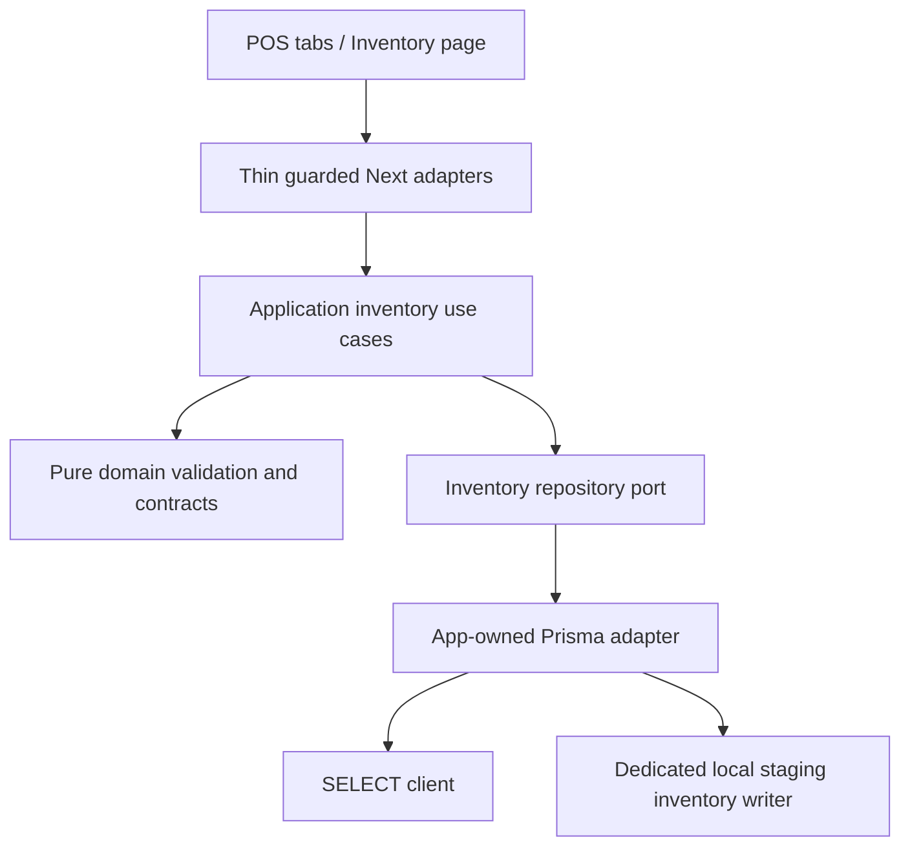

# Technical design

## Architecture

REQ-001: member selection sets both member and default Kredit in one event callback; explicit payment buttons remain unlocked. A null selection resets Cash. REQ-002: shared catalog cap becomes 25; initial tab Product; no category chips. REQ-003: a CenterCart component owns presentation/clear dialog only, using the existing PosScreen cart and lock callbacks. Barcode success selects Keranjang. Right panel retains its state and checkout flow across tab switches. REQ-004: all mutation controls share the existing processing/uncertain lock; no retry/persistence rewrite.

## Inventory interfaces

REQ-005: `/inventory` authenticated page accepts inventory_so or global inventory_view capability, reads company and permission-derived warehouse capability; reuses PosShell with current navigation item. `/api/inventory/stock-opnames` GET lists latest 50 or reads `?id=` detail; `/api/inventory/items?q=` searches 25 branch products including zero/negative stock and locked items, allowing a user to inspect locked availability. Only inventory_so users can use either. Inventory page may be used without an open cashier register.

REQ-006: `/api/inventory/warehouses` GET/POST uses inventory_view plus `ctx.canSwitchBranch` (current policy role <=2). Body `{id?: number,name,mobile,email,status:0|1}` upserts an existing global record, validates fields and rejects duplicate name case-insensitively. Deactivation replaces physical delete. All global writes serialize on the first active company row, independently of selected branch. No fictitious company filter or address field is added.

REQ-007: POST stock-opnames body `{action:'create',requestKey:UUID,period,startDate,endDate,remarks}`. Managed doc number `NXT-SO-<UUID>` (43 characters) persists the UUID, is unique under company mutex, and creation retries return the same draft only when metadata matches; changed metadata returns conflict. UUID-backed identity avoids legacy MAX+1/ALTER AUTO_INCREMENT.

REQ-008: POST body `{action:'count',id,itemId,actualQty,note}`. One item per request; no client stock/cost fields. New lines snapshot stock/cost and set status_so=1; repeat edits use original snapshot. Appended details fill all actual NOT NULL fields (status=1, item_type, konsinyasi, expire fallback `9999-12-31` for untracked expiry). Counts are explicitly saved; zero means counted zero, no implicit uncounted placeholder. Existing line edits require the same managed draft and item lock. No item removal is needed: cancel draft releases selected items.

REQ-009: `{action:'approve',id}`. Company mutex → active user/permission → document FOR UPDATE → details/items in item-ID order. Require owned draft prefix, nonempty and nonduplicate lines; each item must be active, finished, branch-owned, status_so=1 and current stock equal original snapshot. Set stock=actual, status_so=0; append db_stockentry qty=(actual-system), note='Penyesuaian', status=1, entry_date in UTC+7 and matching company/item. Set doc_status=1 in same transaction. Repeated approved managed document returns approved without another audit. Detail calculations stay immutable; no legacy date-range sale subtraction.

REQ-010: `{action:'cancel',id}`. Same transaction locks; require owned draft and valid branch lines. Release status_so then DELETE details/header. A missing canceled ID is a harmless retry; never delete approved/legacy SO or replace stock on cancel. Confirm cancellation in UI. Warehouse deactivate and SO cancellation remain explicit user actions.

## Shared constraints

BR-001, BR-002, VAL-001: pure parsers validate strings/IDs/dates/counts; application use cases authorize operation capability and project branch context; adapter uses parameterized Prisma.sql/raw tagged queries. All numeric money calculations use existing minor-unit helpers and safe integer limits. Counts/detail updates use original snapshots and server cost to compute qty_adjust/sub_total; no money float arithmetic. The existing DOUBLE storage must round-trip the calculated decimal cents exactly; otherwise reject before any lock/write.

SEC-001: reuse AuthServices/guard with csrf:true on POST, never accept company/user scope from body. Repository rechecks permissions after its row lock. Global warehouse privilege requires role <=2 at both application and transaction layer. SEC-002: new `prisma-inventory-write.ts` validates INVENTORY_WRITES_ENABLED='1', POS_WRITE_DATABASE matching existing staging pattern, read/write target equivalence and distinct inventory/POS/register/read users using existing local target validator. No existing .env or grants are edited. Safe placeholder config and provisioning/runbook instructions only.

NFR-001: reuse installed libraries; raw mapping avoids schema changes and regenerated models; limits 25/50, details bounded to 500, additions capped at 500. Company mutex aligns with POS and prevents checkout/SO races in this app. Global Warehouse mutex uses the first active company; all inventory transactions use ReadCommitted and bounded retry on deadlock/lock timeout. OBS-001: safe mutation events + persisted creator and signed stockentries; no sensitive error text.

MIG-001: no DDL or operational SQL rollout. Unit tests use fake dependencies; MariaDB tests provision only a disposable marked synthetic database with actual selected DDL. Historical-schema read check is separate evidence. Disable inventory flag for rollback, finish/cancel managed drafts before removing the feature; never bulk-unlock unknown legacy items or reverse approved counts by deleting audit rows. A correction requires a new SO. Operational cutover needs writer freeze, backup/restore rehearsal, inventory ledger reconciliation and explicit deployment authorization.

Errors: INVALID_INPUT 400; UNAUTHENTICATED 401; FORBIDDEN/CSRF 403; NOT_FOUND 404; STOCK_LOCKED, STOCK_CHANGED, DOCUMENT_IMMUTABLE, EMPTY_DOCUMENT, NAME_EXISTS, REQUEST_CONFLICT 409; WRITE_NOT_CONFIGURED/INVENTORY_UNAVAILABLE 503. Every response Cache-Control:no-store. Unknown input fields confer no authority.
