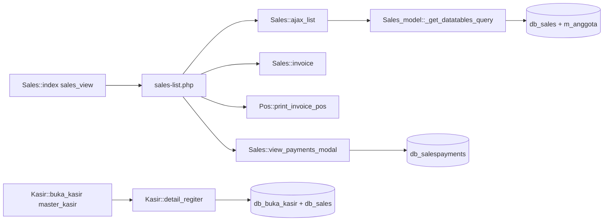

# Current State — Sales Transaction History

## 1. Request, baseline, dan metode audit

Pengguna membutuhkan `/sales` untuk log transaksi POS, detail transaksi, cetak ulang struk, dan kemampuan baca terkait. Fase sekarang hanya spesifikasi. Larangan database/tabel baru diterapkan lebih ketat sebagai **zero DDL**: tidak menambah kolom, index, view, trigger, atau migration.

Baseline dibaca: `README.md`, `CLAUDE.md`, `apps/web/AGENTS.md`, `docs/migration/module-boundaries.md`, `DATA_OWNERSHIP.md`, `POS_DB_INTEGRATION_PLAN.md`, `POS_DB_INTEGRATION_IMPLEMENTATION.md`, `audit_payment_method.md`, dan inventaris `docs/legacy-reference/03-routes.md`, `04-database.md`, `06-business-rules.md`. Root `AGENTS.md`, `.agents/rules.md`, dan `docs/architecture/` tidak ditemukan; dokumentasi migration/refactor menjadi rujukan arsitektur. `docs/migration/prompts.md` adalah konteks audit QRIS terdahulu, bukan instruksi implementasi riwayat.

Source targeted: Sales, Kasir, view detail/list/invoice, adapter receipt, auth, schema Prisma, POS checkout, shell, dan tes terkait. Source PHP hanya dibaca; tidak audit ulang seluruh aplikasi. Baseline checkout: `master-dev`, HEAD `0592e2ea`, working tree bersih sebelum penulisan dokumen.

## 2. Alur legacy terkonfirmasi

| Evidence source / symbol | Perilaku terkonfirmasi |
|---|---|
| `tokonew.kkisitb2.id/application/controllers/Sales.php`: `index`, `ajax_list` | `/sales` memakai `sales_view`; DataTable menghasilkan kolom tanggal, invoice, NIK, pelanggan, metode, total, pembayaran, status, pembuat, action |
| `tokonew.kkisitb2.id/application/models/Sales_model.php`: `_get_datatables_query`, `count_all`, `count_filtered` | Scope list `company_id` dari session; join anggota; tidak membatasi list hanya POS/Final; urutan awal ID descending |
| `Sales.php`: action builder dalam `ajax_list` | Detail `sales_view`; pembayaran tombol `sales_payment_view`; edit `sales_edit`; bayar/hapus/return juga tersedia jika berizin |
| `Sales.php`: `invoice`, `print_invoice`, `print_invoice_pos` | Detail/cetak justru memerlukan `sales_add` atau `sales_edit`; A4 memakai dompdf |
| `application/views/sales-list.php`: `print_pos` | Cetak thermal membuka `pos/print_invoice_pos/{id}` di window baru |
| `Sales.php`: `view_payments_modal`; `Sales_model.php`: `view_payments_modal` | Handler memeriksa `sales_view`, meski tombol memeriksa `sales_payment_view`; query parent/payment hanya ID; modal juga menawarkan delete payment |
| `application/views/sal-invoice.php`: query `$q3` | Header detail dibaca dengan `WHERE b.id='$sales_id'`, tanpa filter company pada query tersebut |
| `application/controllers/Kasir.php`: `buka_kasir`, `detail_regiter` | Menu register dan detail memakai `master_kasir`; `ajax_list` menampilkan buka/tutup, saldo, nomor kasir, pemilik |
| `application/views/kasir-detail.php` | Ringkasan Final Cash/Kredit/QRIS; query parent/session dan sales hanya ID sesi; detail Cash/Kredit memakai join anggota yang dapat menghilangkan UMUM |

## 3. Alur Next.js terkonfirmasi

- `/sales` dan API sales history belum ada di `apps/web/src/app/`.
- `apps/web/src/components/pos/PosShell.tsx` menyediakan sidebar bersama POS, inventory, products. `active` baru mendukung ketiganya; belum ada menu Sales.
- `apps/web/src/app/pos/page.tsx`, `inventory/page.tsx`, `products/page.tsx` masing-masing membangun `PosSession`. Penambahan capability navigasi harus masuk ke semua caller shell.
- `apps/web/src/app/pos/receipt/[id]/page.tsx` dan `infrastructure/pos/handlers/receipt.ts` memakai `sales_add`. API `GET /api/pos/receipts/{id}` memanggil `readReceipt` melalui `PrismaReceiptRepository`.
- `packages/application/src/pos/read-receipt.usecase.ts`: `readReceipt` memvalidasi ID, memakai company context, mengembalikan NOT_FOUND bila tidak ada.
- `apps/web/src/infrastructure/repositories/prisma-receipt.repository.ts`: `find` membatasi header/line/item menurut company; header/line Final; metode dikenal; `return_bit != '0'` ditolak. Cash change dihitung dari `paid_amount - grand_total`.
- `packages/domain/src/pos/payment-method.ts` saat ini mengenal **Cash, QRIS, Kredit**. Query recap `prisma-register.repository.ts` juga memisahkan ketiganya. Audit QRIS lama sudah tertinggal dari source.
- Receipt membaca nama item current (`db_items.item_name`), nama/plafon anggota current, dan penggunaan kredit seluruh bulan transaksi lintas cabang. Ini bukan snapshot plafon saat sale.
- Receipt page menampilkan PPN `0` dan footer pajak tetap; projection belum membawa pajak line. `other_charges_amt` tidak dijadikan change oleh receipt current.
- Checkout `prisma-pos.repository.ts`: `finalize` menyimpan header, harga/qty/diskon/total line; `description` line kosong. Header `customer_name` dan `nik_kar` tersedia. `round_off` ditulis sebagai nilai total yang dibulatkan, sehingga tidak boleh diasumsikan sebagai adjustment.
- `infrastructure/auth/page-guard.ts`: `requirePagePermission`; `auth/http.ts`: `guard`, `json`; `validate-session.usecase.ts`: company hanya dari session, permission direvalidasi, role <= 2 hanya boleh memilih cabang melalui flow auth existing.
- `proxy.ts` mencakup POS/inventory, belum Sales. Proxy hanya cookie gate, bukan enforcement permission.
- Pembacaan tabel operasional memakai Prisma reader `infrastructure/db/prisma.ts`; auth store terpisah dapat melakukan session touch/revoke sebagai perilaku auth existing.

## 4. Data existing dan batas schema

Mappings current di `apps/web/prisma/schema.prisma` lebih kuat untuk rancangan daripada contoh model lama di dokumentasi.

| Entity existing | Kolom utama yang diperlukan | Akses fitur |
|---|---|---|
| `db_sales` / `Sale` | id, company_id, sales_code, sales_date, created_by, customer_id, customer_name, nik_kar, pos, ppob, status, sales_status, payment_status, payment_type, subtotal, grand_total, paid_amount, tot_discount_to_all_amt, other_charges_*, round_off, return_bit, id_kasir, id_buka_kasir | SELECT |
| `db_salesitems` / `SaleItem` | sales_id, company_id, id, item_id, barcode, description, sales_status, status, sales_qty, price_per_unit, discount_amt, tax_amt, tax_type, unit_total_cost, total_cost | SELECT |
| `db_salespayments` / `SalePayment` | sales_id, company_id, id, payment_date, payment_type, payment, change_return, payment_note, created_by, status | SELECT jika izin pembayaran |
| `db_buka_kasir` / `CashierSession` | id, company_id nullable, noref, id_kasir | SELECT metadata/filter |
| `db_kasir` / `Cashier` | id, company_id, no_kasir | SELECT label kasir |
| `db_items` / `Item` | id, company_id, item_name | SELECT fallback label, tidak filter status aktif |
| `db_company`, `db_users`, `db_roles`, `db_permissions` | company aktif, identity/role/permission existing | SELECT via auth existing |

`grand_total` dan sejumlah nominal detail adalah DOUBLE; `paid_amount` DECIMAL(18,2); `db_salespayments.payment` DECIMAL(10,0), bukan dua desimal. ID `db_sales.id_buka_kasir` berbeda dari `id_kasir`; contoh relasi lama di dokumentasi tidak boleh disalin begitu saja. Schema Prisma tidak mendeklarasikan relasi/FK/index untuk tiga model Sale tersebut selain primary ID; kondisi DB deployed **belum dikonfirmasi**.

## 5. Perbaikan yang masuk rencana

1. Date filter legacy membandingkan YEAR/MONTH/DAY secara terpisah: rentang lintas bulan/tahun dapat gagal. Gunakan rentang DATE utuh.
2. Search legacy menonaktifkan grouping OR. Query baru mengelompokkan seluruh search di dalam scope company.
3. `ajax_list` legacy menampilkan pembayaran sebagai `paid_amount - (paid_amount - grand_total)` sehingga selalu grand_total. Tampilkan field tersimpan; jangan mengklaim semuanya lunas.
4. Detail/payment legacy tanpa predicate company → enforce scope parent dan child pada semua pembacaan.
5. Izin tombol vs handler berbeda → satu matriks permission server dan UI.
6. Cetak current terlalu khusus checkout dan gagal menjelaskan transaksi unsupported → perlu izin read dan alasan cetak spesifik.
7. Missing master/UMUM tidak boleh hilang dari list/detail; snapshot header diutamakan.
8. Cetak historis tidak boleh menampilkan plafon current sebagai plafon saat transaksi, atau PPN nol saat tax tersimpan nonzero. Aturan aman di design.

## 6. Testing, integrations, dan ketidakpastian

Tes existing: `apps/web/tests/pos-receipt-http.test.mjs`, `pos-receipt-repository.test.mjs`, `auth-route-guard-scan.test.mjs`, `pos-register-recap-staging.test.mjs`; `packages/application/tests/pos-receipt.test.mjs`. Runner actual Node test (`--experimental-strip-types`), bukan Vitest contoh dokumen lama.

Tidak ada kebutuhan queue/worker, gateway pembayaran, webhook, storage baru, ataupun library print baru. Print memakai `ReceiptPrintButton` → `window.print()` dan `receipt.css` 80 mm.

Belum dikonfirmasi: assignment role/permission deployed, live indexes/SQL mode/collation, volume dan latensi, distribusi non-POS/PPOB/status, sale dengan payment multiple/retur/line hilang, makna historis setiap charge dan rounding, label item/anggota pada waktu transaksi. Tidak ada koneksi DB atau production check pada penyusunan spec. Unknown ini menjadi gate targeted read-only, bukan alasan membuat schema baru atau memperbaiki data lama.
