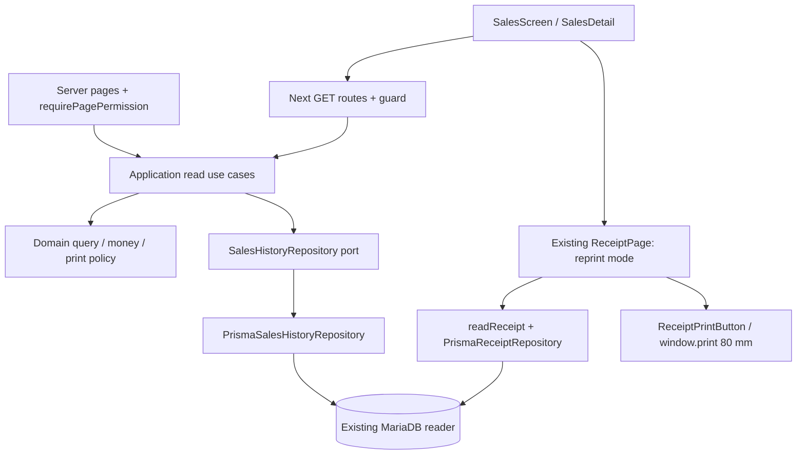

# Technical Design — Sales Transaction History

## D1. System context dan reuse

Addresses: REQ-001, REQ-002, REQ-012, REQ-016, SEC-001, SEC-002, MIG-001, MIG-002, NFR-002.



Gunakan `apps/web` untuk routes/components/composition/adapters, `packages/application` untuk use cases/port, `packages/domain` untuk pure validation/projections/policy. Tidak membuat package, CQRS framework, generic report engine, event bus, atau dependency baru. Port dibutuhkan untuk menjaga boundary yang sudah berlaku dan test aplikasi; bukan adapter mock runtime.

Semua nama **baru yang direncanakan**, bukan existing, ditandai pada tabel berikut.

| Status | Lokasi / tanggung jawab |
|---|---|
| Proposed | `packages/domain/src/sales/history.ts`: query, projections, error codes, eligibility policy murni |
| Proposed | `packages/application/src/sales/read-history.ts`: repository port, list/detail/payment orchestration |
| Proposed | `apps/web/src/infrastructure/repositories/prisma-sales-history.repository.ts`: SELECT + persistence mapping |
| Proposed | `apps/web/src/infrastructure/sales/handlers.ts`: HTTP parsing, guard, errors, sanitized timing logs |
| Proposed | `apps/web/src/app/sales/page.tsx`, `sales/invoice/[id]/page.tsx`: thin guarded pages |
| Proposed | `apps/web/src/app/api/sales/route.ts`, `api/sales/[id]/route.ts`, `api/sales/[id]/payments/route.ts`: thin GET adapters |
| Proposed | `apps/web/src/components/sales/SalesScreen.tsx`, `SalesDetail.tsx`, `sales.css`: filter/list/detail/payment UI |
| Existing, change | Package `package.json` exports: expose sales subpaths, no new package |
| Existing, change | `PosShell.tsx`, `features/pos/types.ts`, POS/products/inventory pages: canSales/canCheckout capability and active sales |
| Existing, change | `proxy.ts`: add `/sales/:path*`, `/api/sales/:path*` cookie gate |
| Existing, change | `read-receipt.usecase.ts`, domain `receipt.ts`, receipt repository/handler/page: permission union, safe reprint projection |

## D2. UX dan routes

Addresses: REQ-001, REQ-003, REQ-004, REQ-005, REQ-006, REQ-011, REQ-013, REQ-014, REQ-015, VAL-001, VAL-002, NFR-003.

Sidebar: “Riwayat Transaksi”, active sales. Semua caller shell memperoleh `canSales` dari server. Tambahkan `canCheckout` agar link POS tidak mengundang akses yang ditolak pada sales_view-only; existing caller menyuplai capability eksplisit. Sales header sendiri berjudul “Riwayat Transaksi”, cabang, user, dan session controls; tidak merender `PosHeader`/`RegisterControls`. Tidak membaca status register sebagai prasyarat history.

Wireframe informasi:

```text
Riwayat Transaksi                          Cabang aktif / User
[Dari] [Sampai] [Sumber: POS] [Status: Final] [Metode: Semua]
[Status bayar] [Pembuat] [ID Sesi] [No struk / NIK / Nama] [Terapkan] [Reset]
Tanggal | No Struk | Pelanggan/NIK | Metode | Total | Paid tersimpan
Status penjualan | Status pembayaran | Pembuat | ID sesi | Aksi
                                                    [Detail] [Cetak ulang]
[Sebelumnya]   halaman / jumlah sesuai filter          [Berikutnya]
```

Daftar memakai field customer snapshot, bukan join wajib anggota. Sumber default POS, tetapi bisa semua/non-POS penjualan barang untuk parity daftar legacy. Status default Final, dropdown Final/Quotation/Hold/Semua; status mentah lain tetap terlihat saat Semua dipilih. Filter metode menyediakan Cash/QRIS/Kredit/Semua dan input raw untuk legacy lain; payment status menyediakan label umum dan raw. Tidak memaksa unknown menjadi Cash.

Filter submit eksplisit, HTML date/input/select native. URL memuat state; kembali ke list dari detail mempertahankan query. Simpan hanya query tervalidasi dalam return link lokal `/sales?...`, bukan redirect URL arbitrary. Browser Back mempertahankan posisi jika memungkinkan. Invoice opens same tab; print link opens new tab `rel="noopener noreferrer"`, label bahwa preview terbuka di tab baru. Reprint dari history memakai `mode=reprint`; tidak otomatis memanggil print saat browsing/refresh preview. Tombol cetak explicit. Auto-print checkout existing tetap berlaku.

Detail memuat header/nominal, table item paginated, warning, metadata sesi, dan panel pembayaran yang hanya dimuat saat dibuka dan berizin. List/date hanya tanggal sales_date, tanpa jam 00:00 atau created_time sebagai jam transaksi. Session ID null/0/foreign tidak memunculkan link detail register; filter ID sesi positif tetap dapat mencari nilai pada header tanpa membaca metadata foreign.

State UI: loading; “Belum ada transaksi untuk filter ini”; INVALID_INPUT; Akses ditolak; session expired → login; NOT_FOUND; SALES_UNAVAILABLE + retry; RECEIPT_UNSUPPORTED + alasan; DATA_INCOMPLETE warning. Perubahan filter mereset page1, request lama dibatalkan/diabaikan. Branch switch existing melakukan reload; key user/company dan hasil baru mencegah stale data.

CSS mengikuti shell current termasuk zoom80%; table di wrapper horizontal lokal, header/action tetap dapat dijangkau pada 375/390/768/1280/1440 px. Keyboard tab, focus, label, aria-busy/live untuk result/error, tombol expanded payment, status berteks. Tidak membuat desain dashboard baru.

## D3. Query, data model, precision

Addresses: REQ-002, REQ-003, REQ-004, REQ-005, REQ-006, REQ-007, REQ-009, REQ-011, REQ-016, BR-001, BR-002, BR-003, BR-004, VAL-001, VAL-002, VAL-003, VAL-004, SEC-003, SEC-004, SEC-005, NFR-001, NFR-003, MIG-001, MIG-002.

### Database DDL / migration / rollback SQL

**Tidak ada DDL atau migration SQL. Tidak ada rollback SQL.** Reuse `Sale`, `SaleItem`, `SalePayment`, `CashierSession`, `Cashier` di schema existing. Tidak `CREATE DATABASE/TABLE/VIEW/INDEX/TRIGGER`, `ALTER`, `db push`, `migrate`, reset, seed, atau backfill. Jangan membangun tabel log/print counter. Reader existing `DATABASE_URL` cukup bila sudah memiliki SELECT yang diperlukan; tidak membaca atau mencetak DSN dalam laporan.

SQL berikut merupakan bentuk query proposed, bukan script yang dijalankan:

```sql
SELECT /* explicit header projection only */ ...
FROM db_sales s
LEFT JOIN db_buka_kasir b ON b.id = s.id_buka_kasir AND b.company_id = :company
LEFT JOIN db_kasir k ON k.id = s.id_kasir AND k.company_id = :company
WHERE s.company_id = :company
  AND s.ppob = 0
  AND s.sales_date >= :from AND s.sales_date < :toExclusive
  /* source/status/method/created_by/id_buka_kasir exact predicates */
  AND (s.sales_code LIKE :literalPattern ESCAPE '!'
       OR s.nik_kar LIKE :literalPattern ESCAPE '!'
       OR s.customer_name LIKE :literalPattern ESCAPE '!')
ORDER BY s.sales_date DESC, s.id DESC
LIMIT :pageSize OFFSET :offset;
```

Search condition dihilangkan bila q kosong. Pattern substring dengan escape `!` menjadi `!!`, `%` menjadi `!%`, `_` menjadi `!_`; quotes/backslashes tetap parameter. Prisma.sql mengikat values; sort ASC/DESC dari enum saja. Source pos → pos=1; nonpos → pos=0; all → tanpa predicate pos. `ppob=0` berlaku pada list/detail/payments untuk scope penjualan barang. Tidak memfilter s.status=1 agar status lama/inaktif tetap terlihat; status mentah ditampilkan.

`COUNT(*)` memakai predicate header identik tanpa join one-to-many. Header tidak dijoin item/payment sehingga count, grand total, dan pagination tidak berlipat. Batasi pageSize/offset/range sesuai VAL. List count+page dapat memakai transaksi SELECT singkat pada snapshot yang sama; tidak lock rows `FOR UPDATE` atau serialize terhadap checkout. Pagination lintas request tetap dapat berubah ketika legacy mengedit/menulis.

Detail header: `s.id=:id AND s.company_id=:company AND s.ppob=0`. Query line/payment mengikat sales_id **dan** company_id; verifikasi parent scoped terlebih dahulu, termasuk sebelum mengevaluasi adanya payment. Semua line status ditampilkan sebagai raw di detail (bukan hanya Final); pagination count/page terpisah. Urutan line ID ASC, payment payment_date ASC lalu ID ASC. Row asing tidak ditampilkan. Bila jumlah line total parent berbeda dari jumlah child scoped, tandai DATA_INCOMPLETE tanpa mengungkap isi/ID child asing. Agregat kontrol parent terbatas ke sale ID yang sudah diautorisasi dan hanya menghasilkan boolean/count untuk integritas, bukan payload foreign data.

Session/master joins LEFT dan company scoped. Tidak filter active item/kasir untuk histori. `customerName` blank → “Nama pelanggan tidak tersimpan”; guest tanpa nama tetap dapat memakai “UMUM” hanya jika customer_id=0 dan NIK kosong/0. NIK tetap string dengan leading zeros. Item description ditampilkan sebagai deskripsi tersimpan; jangan memakai description sebagai nama snapshot yang tidak pernah disimpan. Fallback nama current disertai `labelSource=current_master`; missing master `labelSource=fallback`.

Nominal disajikan sebagai integer sen (nama `*Sen`), nullable untuk invalid data. DOUBLE CAST DECIMAL(18,2), lalu `toMinorUnits`; sum computed di DECIMAL sebelum mapping. Payment DECIMAL(10,0) ditampilkan menurut nilai aktual, tanpa membuat pecahan fiktif. Invalid one row memberi warning, tidak menggagalkan list. Jangan mengirim bigint/Decimal mentah ke JSON. Total header tersimpan tidak direkonsiliasi ulang dari harga item current. Detail menampilkan subtotal, diskon header, grand total, paid_amount, raw other_charges/round_off jika ada; label charge legacy tidak dianggap cash-change.

## D4. API contracts

Addresses: REQ-003, REQ-004, REQ-005, REQ-006, REQ-007, REQ-010, REQ-011, REQ-014, VAL-001, VAL-002, VAL-003, VAL-004, OBS-002.

Semua route proposed hanya GET, cookie session existing, `Cache-Control: no-store`, tanpa company query/body. Unknown/duplicate keys ditolak. Tidak meminta CSRF untuk GET; branch/logout tetap memakai flow POST existing ber-CSRF. Server pages memakai use case yang sama, bukan HTTP self-fetch dan bukan SQL di page.

### `GET /api/sales`

Allowlist: `from`, `to`, `source`, `salesStatus`, `paymentStatus`, `paymentType`, `createdBy`, `registerId`, `q`, `page`, `pageSize`, `sort`. Defaults: from awal bulan WIB, to hari ini WIB, source pos, salesStatus Final, paymentStatus/paymentType all, sort newest, page1, pageSize25; createdBy/registerId/q optional. Date defaults clock yang dapat diinjeksi untuk tes. `all` adalah sentinel tidak memfilter; empty optional boleh dihilangkan oleh UI, nilai query kosong yang tidak valid ditolak.

```json
{
  "items": [{
    "saleId": 42, "salesCode": "POS26100500001", "saleDate": "2026-10-05",
    "customerName": "UMUM", "memberNik": null, "createdBy": "kasir",
    "source": "pos", "salesStatus": "Final", "paymentStatus": "Paid",
    "paymentType": "Cash", "recordStatus": 1, "returnBit": "0",
    "grandTotalSen": 2500000, "paidSen": 3000000,
    "registerId": 7, "registerReference": "REG7", "cashierLabel": "K01",
    "warnings": []
  }],
  "pagination": { "page": 1, "pageSize": 25, "total": 1, "hasNext": false },
  "filters": { "from": "2026-10-01", "to": "2026-10-05", "source": "pos", "salesStatus": "Final" }
}
```

Response `filters` mengembalikan seluruh nilai filter efektif, tidak hanya empat field contoh. Empty results 200 items=[] total0. Nilai contoh synthetic, bukan data pengguna.

### `GET /api/sales/{id}?linePage=1&linePageSize=50`

200 `{sale, lines, linePagination, printEligibility, capabilities, warnings}`. `sale` memuat field header list, subtotalSen, discountSen, grandTotalSen, paidSen, otherChargesInputSen, otherChargesSen, roundOffLegacySen; `lines` memuat lineId/itemId/barcode/label/labelSource/description/quantity/unitPriceSen/discountSen/taxId/taxSen/taxType/totalSen/status/salesStatus. Tidak memuat HPP. `capabilities.canViewPayments` dihitung dari dua permission; tidak mengirim payment row otomatis.

`printEligibility`: `{allowed: true, reasons: []}` atau `{allowed: false, reasons: ["RETURN_UNSUPPORTED"]}`. Alasan enum pada D5; detail non-Final/non-POS/unknown tetap 200. Warnings menyebut code/field, tanpa raw SQL.

### `GET /api/sales/{id}/payments?page=1&pageSize=25`

200 `{payments, pagination}`; setiap row `paymentId, paymentDate, paymentType, paymentSen, changeSen, note, createdBy, status`. Tampilkan active dan inactive/zero rows secara jujur; tidak menyediakan delete/add. Multiple methods tidak disederhanakan menjadi satu. Catatan escaped plain text, expandable. Empty payments 200 [], bukan bukti Paid. Parent foreign/missing →404; permission dicek lebih dulu →403 untuk unauthorized tanpa existence oracle.

### Errors

| Status | Code | Perlakuan |
|---|---|---|
| 400 | INVALID_INPUT | Query/ID malformed; tidak membaca repo sebelum parsing selesai |
| 401 | UNAUTHENTICATED | API; page redirect login |
| 403 | FORBIDDEN | Permission; page forbidden notice mengikuti convention existing |
| 404 | NOT_FOUND | Parent absent/foreign/outside goods-sales scope; page notFound |
| 409 | RECEIPT_UNSUPPORTED | API receipt mode reprint; reasons terstruktur, page tampilkan pesan dan return link |
| 503 | SALES_UNAVAILABLE / POS_UNAVAILABLE / AUTH_UNAVAILABLE | Layanan/DB/config sesuai adapter existing; no-store, retry baca |

Unexpected error →500 INTERNAL melalui helper existing; raw message tidak keluar. ID invalid receipt page tetap memakai notFound sesuai convention existing, receipt API400.

## D5. Safe reprint dan backward compatibility

Addresses: REQ-008, REQ-009, REQ-010, REQ-012, BR-001, BR-002, BR-003, BR-004, BR-005, VAL-003, VAL-004, SEC-002, SEC-003, SEC-004, NFR-002, OBS-002.

Reuse `/pos/receipt/{id}?mode=reprint` dan `GET /api/pos/receipts/{id}?mode=reprint`. `mode` enum checkout/reprint, unknown →invalid; server menentukan mode efektif: reprint jika diminta **atau** user tidak memiliki sales_add. Tidak membiarkan sales_view-only memilih checkout mode untuk mengambil plafon current. Query bukan pemberian izin.

Gate receipt: validate session sekali, cek sales_add OR sales_view menggunakan permission helper existing; error pada pembacaan permission tetap fail closed. New Sales page/API selalu sales_view; receipt exception tidak memberi sales_add-only akses list/detail/payments Sales.

Mode checkout mempertahankan auto-print, return `/pos`, dan perilaku Cash/QRIS/Kredit existing untuk kasir sales_add. Mode reprint memakai return link fixed `/sales` (atau query lokal tervalidasi), menampilkan “Cetak ulang”, tanggal sales_date asli, tanpa jam palsu. `autoprint`/`print` existing tidak mengaktifkan auto-print ketika mode efektif reprint. Tidak membaca `m_anggota`/monthly aggregate sehingga histori tidak bocor lintas cabang. Metadata toko current tidak diklaim snapshot toko historis; angka sale tetap tersimpan. Header receipt dapat memakai current store address existing.

Eligibility reprint dibuat dalam policy pure berdasarkan fakta terpetakan, dicek di detail dan diulang saat preview. SELECT fakta menggunakan reader; permission pembayaran hanya mengontrol payload payment detail, bukan check internal eligibility. Jangan mengembalikan nominal/catatan payment melalui reasons kepada pengguna tanpa permission.

| Rule | Reason saat gagal |
|---|---|
| Sale company aktif, goods POS pos=1 ppob=0, Final dan status=1 | NON_POS / NON_FINAL / INACTIVE_RECORD |
| return_bit tepat '0'; jangan NULL/blank dianggap bukti tidak ada retur untuk reprint | RETURN_UNSUPPORTED |
| Metode dikenal Cash/QRIS/Kredit; payment_status Paid atau Dibayar | PAYMENT_METHOD_UNSUPPORTED / PAYMENT_NOT_SETTLED |
| Ada line same-company, Final, active; tidak ada child foreign atau inconsistent; <=200 line | ITEMS_MISSING / DATA_INCOMPLETE / PRINT_TOO_LARGE |
| Angka wajib valid dan nonnegative; quantity positif; grand_total>0; paid>=grand untuk Cash; paid=grand untuk QRIS/Kredit | INVALID_SAVED_AMOUNT |
| Satu active positive payment row dalam company, metode cocok header; tidak ada child payment foreign; multi-payment/empty ditolak | PAYMENT_DATA_UNSUPPORTED |
| Seluruh total_cost dijumlahkan sama dengan subtotal header; grand_total = subtotal - diskon header pada precision sen; biaya tambahan tidak ambigu | LEGACY_TOTALS_UNSUPPORTED |

Payment amount bukan sumber pengganti paid_amount/grand_total: DECIMAL(10,0) dapat membulatkan fractional amount. Ketidakcocokan row payment vs header ditampilkan sebagai warning jika berizin; jangan mengubah nilai header atau menciptakan nilai payment baru. Multiple active payment dan unsupported method tetap blokir format reguler.

Charge check: QRIS/Kredit other_charges_input/amt harus null/zero. Cash hanya menerima null/zero atau nilai yang tepat sama dengan paid_amount-grand_total; jika tax ID charge nonzero atau field lain mengindikasikan charge nyata, blokir LEGACY_TOTALS_UNSUPPORTED. `round_off` tidak ditambah/dikurang otomatis. Encoding existing zero atau ROUND(grand_total) diterima sebagai metadata saja; nilai lain tetap memblokir format reguler. Policy shared pada domain menjaga detail dan preview konsisten. Header/line yang tidak memenuhi formula sederhana tetap terlihat detail dengan raw amounts; format extended masuk backlog.

Untuk line tax: gunakan tax_amt tersimpan sebagai nilai pajak line; jumlahkan di sen dan tampilkan “Pajak tercatat” pada reprint, **tidak menambahkannya lagi ke grand_total**. Bila tax kosong/ambiguous dengan tax_id/type nonempty yang belum terverifikasi, blokir LEGACY_TOTALS_UNSUPPORTED. Jangan menampilkan PPN0/footer “Harga Sudah Termasuk PPN” secara unconditional dalam mode reprint. Tanpa pajak tersimpan, footer netral “Terima kasih atas kunjungan Anda”. Diskon line di mode reprint dilabel “Diskon tercatat” tanpa asumsi per-item yang belum tervalidasi.

Receipt projection diperluas seperlunya untuk reprint mode, tax/provenance/warnings; harga, qty, diskon dan total tetap field existing. Missing item master masih dapat dicetak dengan fallback item ID; batas label current terlihat pada preview tanpa mengganggu width80mm. Name snapshot pelanggan tidak ditimpa anggota current.

List menawarkan preview; known flags non-Final/non-POS/retur/unknown method dapat disable action awal. Detail memberikan eligibility penuh. Preview selalu memeriksa ulang; list stale tidak menjamin cetak. Browser print hanya membuka dialog; cancel dan repeated print tidak menulis apa pun. Refresh preview tidak auto-print. Tidak ada nomor salinan permanen atau konfirmasi printer sukses.

## D6. Authorization dan privacy

Addresses: REQ-007, REQ-012, REQ-013, REQ-016, SEC-001, SEC-002, SEC-003, SEC-004, SEC-005.

| Operation | Permission server | Branch rule |
|---|---|---|
| Menu/list/detail/filter sesi | sales_view | companyId active session |
| Payment rows | sales_view AND sales_payment_view | scoped parent + child company |
| Receipt checkout | sales_add OR sales_view; checkout-only projection perlu sales_add | existing company scope |
| Receipt reprint | sales_add OR sales_view; Sales navigation perlu sales_view | company + goods-sale scope |
| Full register management | Di luar delivery | master_kasir kelak, bukan turunan sales_view |
| Branch change/logout | Existing auth policy/CSRF | existing role <=2 dan register guard dipertahankan |

Meskipun role admin dapat memilih cabang, satu request selalu satu active company. Query company dari client ditolak (tidak dituruti). Sales read tidak membutuhkan user pemilik sale atau register aktif: pembaca berizin melihat seluruh sale cabang, termasuk sale kasir lain. Transaksi “legacy-owned” tetap SELECT-only; tidak memanggil checkout/register open/close atau rebuild cache. Session touch/revoke pada auth store existing tetap perilaku auth, bukan mutasi penjualan.

## D7. Performance, observability, rollout

Addresses: REQ-014, REQ-016, NFR-001, NFR-002, NFR-003, OBS-001, OBS-002, MIG-001, MIG-002, MIG-003.

Bounded queries: list count+page; detail header+line count/page+constant-number eligibility aggregates; payment parent+count/page; receipt maximum200 line. Tidak per-row member/stock/credit lookup. Query daftar tidak membutuhkan eligibility penuh untuk setiap row. Audit SELECT-only `INFORMATION_SCHEMA.COLUMNS`, `STATISTICS`, EXPLAIN memverifikasi index actual; schema Prisma tidak dianggap bukti index deployment.

Logs memakai logger existing dengan operation/duration/error code, tanpa q/NIK/nama/invoice/payment note/SQL/DSN. Warning response dan UI membedakan data gap dari empty result. Tidak menyimpan audit baru atau log successful physical print. Data quality yang ambigu menghalangi print, tidak menghalangi baca.

Aktivasi: build kode, review, jalankan regression, targeted reader/schema/permission checks dan benchmark pada staging existing yang sudah disetujui. Tidak menjalankan scripts setup/disposable DB/fixtures SQL yang CREATE tabel. Jika performance gagal, optimasi query/range lebih dulu; index DDL tidak boleh menjadi workaround diam-diam. Jika schema/privilege belum tersedia, catat gate yang gagal dan layanan unavailable, tanpa fixture fallback.

Rollback: revert rilis kode Sales dan perubahan receipt melalui build sebelumnya, pastikan checkout receipt tetap berfungsi. Tidak mengeksekusi rollback SQL dan tidak menghapus/memperbaiki histori. Tidak deploy/push sebagai bagian penyusunan spec. Produksi acceptance tetap terpisah dari local/staging evidence.
