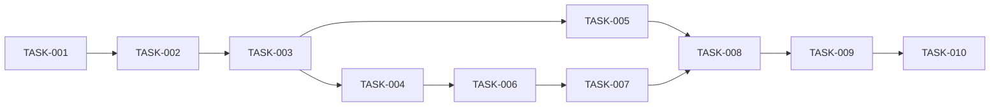

# Implementation Tasks — Sales Transaction History

Status setelah implementasi lokal 5 Oktober 2026: TASK-002..TASK-008 sudah diimplementasikan dan memiliki unit/contract coverage lokal. TASK-001 belum lengkap karena gate pembacaan staging existing belum dijalankan. Browser UI lokal sekarang telah diuji; TASK-009 dan TASK-010 tetap terbuka untuk staging schema/index/privilege, role/cabang live, benchmark, validasi PDF 80 mm/printer fisik dan rollback rehearsal. Tidak ada DDL, migration, seed, atau akses DB operasional pada pekerjaan ini.

## Phase 1 — Baseline dan characterization

- [ ] **TASK-001 — Konfirmasi targeted read-only gates dan bekukan contoh perilaku** *(partial: local schema/source characterization dan regression unit selesai; staging reader/schema/index/volume belum diverifikasi)*
  - Depends on: review spec.
  - Files: dokumen spec ini, `apps/web/prisma/schema.prisma`, existing receipt/auth tests; proposed `apps/web/tests/sales-history-staging.test.mjs`.
  - Goal: verifikasi SELECT privileges/kolom/index/status/payment/retur/line dan volume pada staging existing yang disetujui, tanpa schema change atau menulis row. Catat data kosong/akses unavailable sebagai gate belum lulus; jangan membuat DB/tabel atau seed.
  - Requirements: REQ-002, REQ-009, REQ-010, BR-001, BR-002, BR-003, BR-004, MIG-001, MIG-002, MIG-003.
  - Verification: source inventory di current-state; SELECT metadata + EXPLAIN terbatas; existing receipt tests command di verification. Tidak membaca/mencetak protected env atau payload pelanggan dalam laporan. Pilih sample tanpa menyimpan PII dalam fixture repo.

## Phase 2 — Domain dan application reads

- [x] **TASK-002 — Implement validation/projections/read use cases**
  - Depends on: TASK-001 untuk mapping; pure tests dapat mulai tanpa live DB.
  - Files: proposed `packages/domain/src/sales/history.ts`, `packages/application/src/sales/read-history.ts`; existing kedua `package.json` exports; proposed `packages/domain/tests/sales-history.test.mjs`, `packages/application/tests/sales-history.test.mjs`.
  - Goal: dates valid/max93hari, query/ID/page/sort allowlists, money safe/null warnings, history/detail/payment ports, pure eligibility facts. Gunakan clock injectable untuk defaults WIB; tidak mengimpor Prisma/Next ke packages.
  - Requirements: REQ-002, REQ-003, REQ-004, REQ-005, REQ-006, REQ-007, REQ-009, REQ-010, REQ-011, BR-001, BR-002, BR-003, BR-004, BR-005, VAL-001, VAL-002, VAL-003, VAL-004, OBS-002.
  - Verification: domain/application proposed tests; dates lintas tahun, invalid calendar, literal search, leading-zero NIK, unsupported money/method/return, no fake history values. Tests memeriksa behavior, bukan hanya text source.

## Phase 3 — Existing reader adapter dan API

- [x] **TASK-003 — SELECT repository dengan scope company dan bounded reads** *(adapter diuji dengan fake Prisma; real query plans/data belum diverifikasi)*
  - Depends on: TASK-002.
  - Files: proposed `apps/web/src/infrastructure/repositories/prisma-sales-history.repository.ts`, `apps/web/tests/sales-history-repository.test.mjs`; existing `infrastructure/db/prisma.ts` direuse tanpa writer/config baru.
  - Goal: list+count predicate sama, parent-first detail/payments, all child scope, LEFT metadata/fallback, DECIMAL mapping, integrity warning dan print facts, tanpa N+1.
  - Requirements: REQ-002, REQ-003, REQ-004, REQ-005, REQ-006, REQ-007, REQ-009, REQ-010, REQ-011, REQ-016, BR-001, BR-002, BR-003, BR-004, VAL-003, VAL-004, SEC-003, SEC-004, SEC-005, NFR-001, NFR-003, MIG-001, MIG-002.
  - Verification: repository tests menilai parameter values/predicate grouping, deduplicated count, missing/foreign child/master, inactive headers, statuses dan decimal rounding. Staging SELECT comparisons tidak membuat data test.

- [x] **TASK-004 — Guarded GET routes dan errors/logging**
  - Depends on: TASK-003.
  - Files: proposed `apps/web/src/infrastructure/sales/handlers.ts`, tiga `apps/web/src/app/api/sales/**/route.ts` dalam design; proposed `apps/web/tests/sales-history-http.test.mjs`; existing `auth/http.ts`, `proxy.ts`, `auth-route-guard-scan.test.mjs`.
  - Goal: session+permission sebelum repo; Sales sales_view, payments tambahan sales_payment_view; reject client company/unknown keys; sanitized errors; no-store; logging operation/duration/code; add proxy matchers.
  - Requirements: REQ-003, REQ-004, REQ-005, REQ-006, REQ-007, REQ-010, REQ-011, REQ-012, REQ-014, REQ-016, VAL-001, VAL-002, VAL-004, SEC-001, SEC-002, SEC-003, SEC-004, SEC-005, OBS-001, OBS-002.
  - Verification: HTTP permission matrix, revoked/expired session, false-cookie proxy pass with real guard rejection, same404 foreign/missing, no DB reads unauthorized, unavailable≠empty, no sensitive log/response.

## Phase 4 — Safe receipt reuse

- [x] **TASK-005 — Receipt permission union, effective mode, historical accuracy** *(local checkout/reprint regression diuji; sample staging 80 mm belum diuji)*
  - Depends on: TASK-002, TASK-003.
  - Files: existing `packages/domain/src/pos/receipt.ts`, `packages/application/src/pos/read-receipt.usecase.ts`, `apps/web/src/infrastructure/repositories/prisma-receipt.repository.ts`, `infrastructure/pos/handlers/receipt.ts`, `app/pos/receipt/[id]/page.tsx`, `receipt.css`, `components/pos/ReceiptPrintButton.tsx` hanya jika diperlukan; existing receipt tests.
  - Goal: sales_add OR sales_view; effective reprint mode bagi viewer; eligibility ulang; persisted snapshot/provenance/tax; hide credit aggregates pada reprint; explicit errors; return history link; preserve checkout auto-print.
  - Requirements: REQ-008, REQ-009, REQ-010, REQ-012, REQ-014, BR-001, BR-002, BR-003, BR-004, BR-005, VAL-002, VAL-003, VAL-004, SEC-001, SEC-002, SEC-003, SEC-004, SEC-005, NFR-002, OBS-001, OBS-002.
  - Verification: sales_view-only memilih checkout tetap dipaksa reprint dan tidak query m_anggota; sales_add-only existing checkout tetap lulus; nonzero tax tidak tampil PPN0; partial/retur/multi-payment/ambiguous totals blokir; fractional header tetap exact; preview reload tidak auto-print. No counter/no business write.

## Phase 5 — UI dan navigasi

- [x] **TASK-006 — Menu serta session capabilities di semua caller**
  - Depends on: TASK-004.
  - Files: existing `components/pos/PosShell.tsx`, `features/pos/types.ts`, `app/pos/page.tsx`, `app/inventory/page.tsx`, `app/products/page.tsx`; proposed Sales page.
  - Goal: active sales, canSales/canCheckout berasal dari server, history tanpa checkout/register controls; branch/session controls existing.
  - Requirements: REQ-001, REQ-012, REQ-013, REQ-015, REQ-016, SEC-001, SEC-002, NFR-002.
  - Verification: menu di POS/products/inventory/Sales, sales_view-only direct entry, no active register, no writer available; branch reload dan revocation; typecheck seluruh caller.

- [x] **TASK-007 — List, filters, pagination, dan URL restoration** *(server-rendered navigation and static UI checks; authenticated browser matrix remains in TASK-009)*
  - Depends on: TASK-004, TASK-006.
  - Files: proposed `app/sales/page.tsx`, `components/sales/SalesScreen.tsx`, `sales.css`; proposed `apps/web/tests/sales-history-browser.mjs`.
  - Goal: list real data/defaults, responsive table, filters native, reset page, request cancellation, distinct loading/empty/error, preserve query return.
  - Requirements: REQ-001, REQ-002, REQ-003, REQ-004, REQ-005, REQ-009, REQ-010, REQ-011, REQ-013, REQ-014, REQ-015, VAL-001, VAL-002, SEC-004, SEC-005, NFR-003, OBS-002.
  - Verification: manual/browser scenarios V01..V12/V17..V19 di verification; no fake rows/fixture fallback, count/filter parity, stale response tidak menang.

- [x] **TASK-008 — Detail, gated payments, dan reprint actions** *(payment/detail UI contract tests pass; real-browser/payment fixtures remain in TASK-009)*
  - Depends on: TASK-005, TASK-007.
  - Files: proposed `app/sales/invoice/[id]/page.tsx`, `components/sales/SalesDetail.tsx`, `sales.css`, browser suite.
  - Goal: header/lines/raw status/money warning, session ref, payment lazy load berizin, eligibility reason, 80mm preview/cetak action dan return list.
  - Requirements: REQ-006, REQ-007, REQ-008, REQ-009, REQ-010, REQ-011, REQ-012, REQ-013, REQ-014, REQ-015, BR-001, BR-002, BR-003, BR-004, BR-005, VAL-003, VAL-004, SEC-002, SEC-003, SEC-004, OBS-002.
  - Verification: V06..V16/V19; jumlah payment tidak disamakan dengan header otomatis; XSS plain text; fallback master; unsupported tetap bisa detail; exact print preview rendered.

## Phase 6 — Acceptance dan activation handover

- [ ] **TASK-009 — Integrasi SELECT-only, performance, dan regression**
  - Depends on: TASK-001..TASK-008.
  - Files: proposed `apps/web/tests/sales-history-staging.test.mjs`, `sales-history-browser.mjs`; existing receipt/register/checkout tests; verification document.
  - Goal: uji pada staging existing ber-reader-only; compare data tersimpan, auth/cabang, benchmark 30 reads/op, rendered80mm, five viewports, regression checkout/register. Tidak provision/seed DB/tabel; edge case synthetic cukup fake memory tanpa DDL.
  - Requirements: REQ-001, REQ-002, REQ-003, REQ-004, REQ-005, REQ-006, REQ-007, REQ-008, REQ-009, REQ-010, REQ-011, REQ-012, REQ-013, REQ-014, REQ-015, REQ-016, NFR-001, NFR-002, NFR-003, SEC-001, SEC-002, SEC-003, SEC-004, SEC-005, MIG-001, MIG-002.
  - Verification: commands dan V01..V22; opt-in skipped/runtime unavailable tidak dianggap acceptance-pass. Writer regression existing yang memutasi DB hanya dijalankan jika otorisasi terpisah sudah ada; requirement fitur baca dibuktikan tanpa menulis transaksi baru.

- [ ] **TASK-010 — Handover dan code-only rollout/rollback plan**
  - Depends on: TASK-009.
  - Files: spec verification, proposed `docs/migration/SALES_TRANSACTION_HISTORY_IMPLEMENTATION.md`.
  - Goal: tulis evidence per gate, batas data/cetak, remaining runtime gates, reader/mapping/permission checks, rollback build sebelumnya; jangan push/deploy otomatis.
  - Requirements: NFR-001, NFR-002, OBS-001, OBS-002, MIG-001, MIG-002, MIG-003.
  - Verification: scoped Git diff menunjukkan tidak ada migration/schema/provision/grant/checkout-writer changes; all traceability validated; rehearsal code-only rollback pada lingkungan yang disetujui dan smoke receipt existing. Bedakan implementation complete, local acceptance, staging acceptance, dan produksi.

## Urutan dependensi

